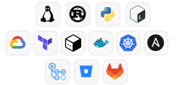

---

### 🙋‍♀️ About me

I'm an DevOps & Systems Engineer Apprentice studying at [Polytech Montpellier](https://polytech.umontpellier.fr) and working at [RAILwAI](https://www.railwai.com/en) — building CI pipelines, managing our hybrid infrastructure (GCP and on-premise), and automating infrastructure with Terraform/OpenTofu.

🔭 Deepening my knowledge of Kubernetes internals, Cloud, GitOps and FinOps 
🧠 Fascinated by neurosciences and Deep Learning 
🎨 Creative mind — I love drawing in my free time

---

### 🚀 Projects

**[⚓ Barenetes](https://github.com/do-2k25-28/Barenetes)** — Minimal container orchestration engine written in Rust 
*Open-source contributor*

**[🏋️ weight-estimation](https://github.com/nadouulh/weight-estimation)** — Deep Learning & Computer Vision for ergonomic evaluation (REBA score) 
*Internship @ IMT Mines Alès — EuroMov Digital Health in Motion*

**[🎵 doremix](https://github.com/nadouulh/doremix)** — Collaborative music ecosystem powered by YouTube 
*School Project — Web app + CLI*

---

<h3>🛠️ Tech Stack</h3>

---

<!--

## 🐍 My Contributions

---

### 📊 GitHub Stats

  <a href="https://github.com/nadouulh">
    <picture>
      <source media="(prefers-color-scheme: dark)" srcset="https://github-readme-stats.anuraghazra1.vercel.app/api?username=nadouulh&show_icons=true&theme=radical&hide_border=true" />
      <source media="(prefers-color-scheme: light)" srcset="https://github-readme-stats.anuraghazra1.vercel.app/api?username=nadouulh&show_icons=true&theme=default&hide_border=true" />
      
    </picture>
  </a>
  <a href="https://github.com/nadouulh">
    <picture>
      <source media="(prefers-color-scheme: dark)" srcset="https://github-readme-stats.anuraghazra1.vercel.app/api/top-langs/?username=nadouulh&layout=compact&theme=radical&hide_border=true" />
      <source media="(prefers-color-scheme: light)" srcset="https://github-readme-stats.anuraghazra1.vercel.app/api/top-langs/?username=nadouulh&layout=compact&theme=default&hide_border=true" />
      
    </picture>
  </a>

----->

### 🌍 Languages

